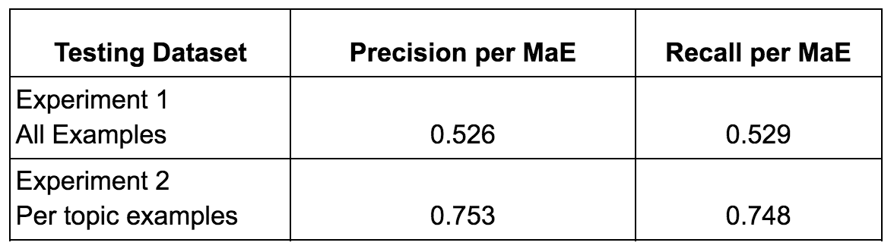
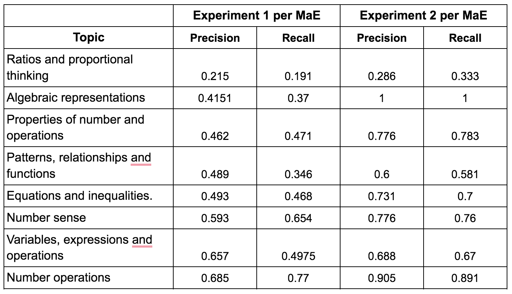
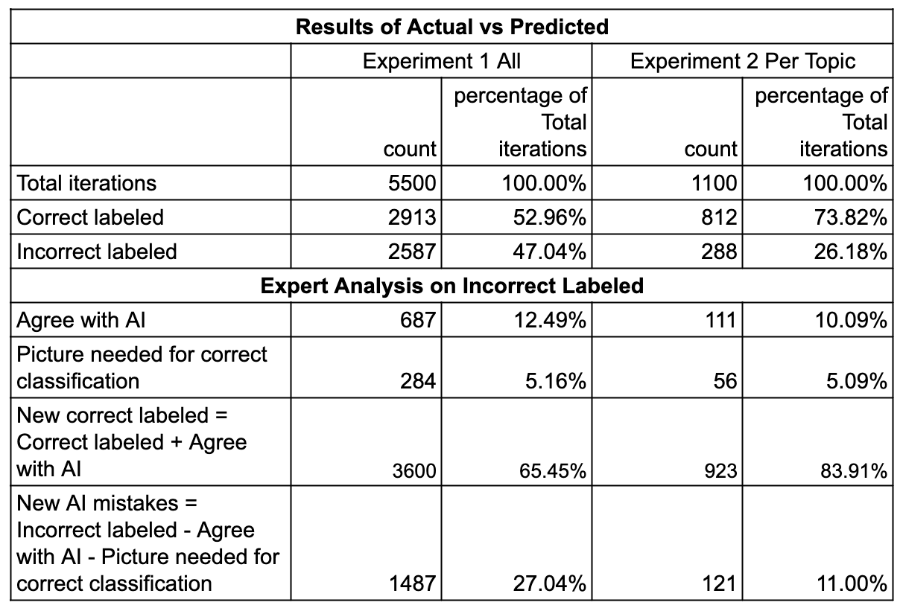

# **MaE: Math Misconceptions and Errors Dataset**

This dataset supports the research described in the paper [A Benchmark for Math Misconceptions: Bridging Gaps in Middle School Algebra with AI-Supported Instruction](https://arxiv.org/abs/your-link) by Nancy Otero, Stefania Druga, and Andrew Lan.

### **Overview**
The **MaE (Math Misconceptions and Errors)** dataset is a collection of 220 diagnostic examples designed by math learning researchers that represent 55 common algebra misconceptions among middle school students. It aims to provide insights into student errors and misconceptions in algebra, supporting the development of AI-enhanced educational tools that can improve math instruction and learning outcomes.

## **Dataset Details**

* Total Misconceptions: 55
* Total Examples: 220
* Topics Covered:

1. **Number sense** (MaE01-MaE05)
   - Understanding numbers and their relationships
2. **Number operations** (MaE06-MaE22)
   - Integer subtraction
   - Fractions and decimal operations
   - Order of operations
3. **Ratios and proportional reasoning** (MaE23-MaE28)
   - Ratio concepts
   - Proportional thinking
   - Problem-solving with ratios
4. **Properties of numbers and operations** (MaE31-MaE34)
   - Commutative, associative, and distributive properties
   - Algebraic manipulations
   - Order of operations
5. **Patterns, relationships, and functions** (MaE35-MaE42)
   - Pattern analysis and generalization
   - Tables, graphs, and symbolic rules
   - Function relationships
6. **Algebraic representations** (MaE43-MaE44)
   - Symbolic expressions and graphs
   - Multiple representations
   - Linear equations
7. **Variables, expressions, and operations** (MaE45-MaE48)
   - Expression structure
   - Polynomial arithmetic
   - Equation creation and reasoning
8. **Equations and inequalities** (MaE49-MaE55)
   - Linear equations and inequalities
   - Proportional relationships
   - Function modeling

Each misconception is represented by four diagnostic examples, featuring both correct and incorrect answers. The examples include detailed explanations to highlight the reasoning behind the errors.

## **Data Format**
The dataset is stored in a JSON format with the following fields:
* **Misconception:** Description of the misconception.
* **Misconception ID:** Unique identifier for each misconception.
* **Topic:** Category of the misconception.
* **4 Diagnostic Examples,** each containing:
  - Question
  - Incorrect answer demonstrating the misconception
  - Correct answer
  - Source reference
  - Images or graphs (where applicable)

## **Validation**

* Dataset tested with GPT-4, achieving 83.9% accuracy when constrained by topic
* Validated by middle school math educators
* 80% of surveyed teachers confirmed encountering these misconceptions in their classrooms

## **Intended Use**
The MaE dataset is designed to:

1. **Support AI development:** AI models can use this dataset to diagnose algebra misconceptions in students' responses.
2. **Aid educators:** Teachers can use the dataset to understand common student errors and adjust instruction accordingly.
3. **Enhance curriculum design:** By identifying frequent misconceptions, curriculum developers can create targeted interventions to address these learning gaps.

# **Experimental Results**

The dataset was evaluated using GPT-4 through two main experiments to assess its effectiveness in identifying math misconceptions. GPT-4 parameters in both experiments were temperature=0.2, max_tokens=2000, and frequency_penalty=0.0.

## **Experimental Design**

* **Experiment 1 (Cross-Topic Testing):** One example from each misconception was randomly selected as training data, and another example was randomly selected as test data from the entire dataset. This approach tested the model's ability to identify misconceptions across all topics without constraints.
* **Experiment 2 (Topic-Constrained Testing):** Similar to Experiment 1, but test examples were only selected from within the same topic as the training example (e.g., if training on a "Number Operations" misconception, testing was done only on other "Number Operations" examples). This approach evaluated the model's performance when constrained to specific mathematical domains.

Both experiments were repeated 100 times to ensure robust results, and each used the same format where GPT-4 was provided with one example to learn from and then asked to identify misconceptions in new examples.

### **General Performance**

* **Experiment 1** (Random selection across all topics):
  - Precision: 0.526
  - Recall: 0.529
  - Overall accuracy: 65.45% (including expert-validated corrections)

* **Experiment 2** (Topic-constrained testing):
  - Precision: 0.753
  - Recall: 0.748
  - Overall accuracy: 83.91% (including expert-validated corrections)
 
   

### **Topic-Specific Performance**
Performance varied significantly across different mathematical topics:

* **Highest Performance:**
  - "Algebraic representations" achieved perfect scores (1.0) in topic-constrained testing
  - "Number operations" showed strong results with 0.685 precision and 0.77 recall in general testing
* **Challenging Areas:**
  - "Ratios and proportional thinking" proved most challenging, with lowest scores:
     + General testing: 0.215 precision, 0.191 recall
     + Topic-constrained testing: 0.286 precision, 0.333 recall
   
     

     

## **Expert Validation**

Two experienced algebra educators reviewed GPT-4's misconception classifications, particularly focusing on cases where the model's predictions differed from the original dataset labels. The educators agreed on 90.91% of their assessments and resolved disagreements through joint review. Their analysis revealed several important insights:

* Some student answers might demonstrated multiple valid misconceptions beyond the original single label
* Certain misconceptions were found to be subsets of broader misconceptions
* A portion of GPT-4's apparent "errors" were actually valid alternative classifications

This expert validation significantly improved the assessed accuracy of GPT-4:

* In Experiment 1: Initial accuracy of 52.96% increased to 65.45%
* In Experiment 2: Initial accuracy of 73.82% increased to 83.91%

 

These results demonstrate that:

1. Some mathematical concepts, particularly ratios and proportional thinking, remain challenging for AI to assess
2. The model performs best when evaluating misconceptions within their specific topic domains
3. Expert validation plays a crucial role in improving accuracy assessments and validating models accuracy

The experimental outcomes suggest that while AI can effectively identify many common mathematical misconceptions, its performance is optimized when operating within specific topic constraints and supplemented by expert oversight.
